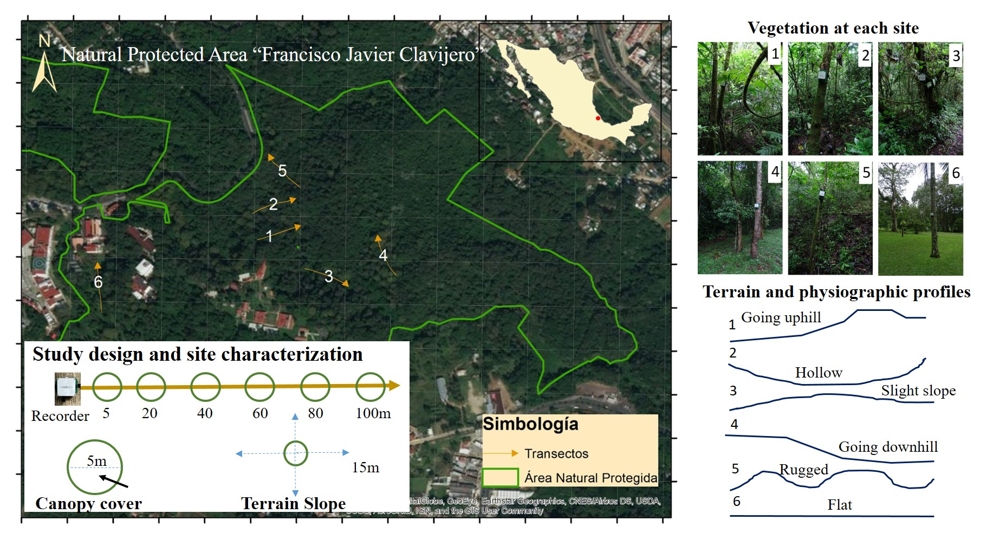
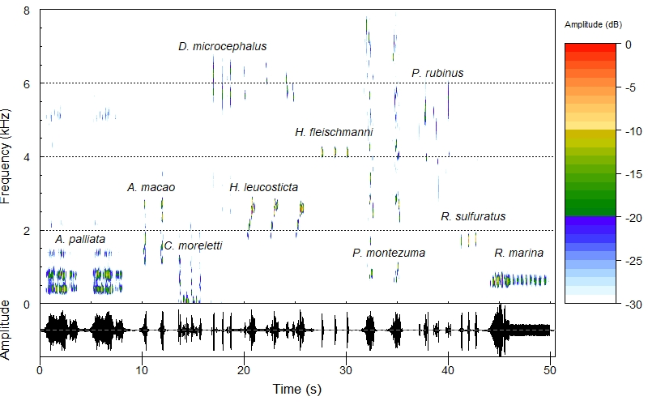

# Introduction {-}

Human alteration of ecosystems is affecting severely the diversity of life on Earth, being the land-use change and climate change the two major threats on terrestrial ecosystems[@Salaetal2000; @Primack2010]. Acoustic monitoring offers an efficient and effective method to assess biodiversity [@Riede1993]. Automated Recording Digital Systems (ADRS) constitute the fundamental equipment to record the sound environment at a specific site [@Acevedo2006]. Although there is a variety of acoustic sensors, it is necessary to improve the technique to achieve greater representation of biodiversity and to know the resolution of the study, useful to predict and spatialize the patterns of acoustic activity. The probability of detecting an animal typically depends on its distance to the observer or the sensor [@Marques2013]. However, few studies have mentioned the maximum range or the area covered by the recording devices [@Llusia2012]. It is relevant to consider that the reaching distance of the devices delimits the *detection space* of the soundscape or the acoustic community of interest. Sound energy, measured in decibels (dB) as amplitude and that is commonly understood as sound intensity, decreases or attenuates when sound waves propagate in the medium. The sound attenuation phenomenon is due to three main factors: distance spreading, absorption of the medium (heat conduction, viscosity or losses due to molecular relaxation), and other phenomena of wave dispersion (reflection, refraction, diffraction, and absorption by changes in the impedance of the medium) [@Sueur2018]. The absorption of the medium and the dispersion phenomena are difficult to model since they depend on several parameters such as frequency, humidity, temperature, pressure and physical properties of the obstacles that generate dispersion; on the contrary, spreading losses are easier to predict if there is a *reference intensity* and a *reference distance* [@Sueur2018].

The amplitude of the signal at the source (*source level*) can be extremely different between species and cause marked differences in detection distances [@Llusia2012]. In addition, the sound loses power according to its frequency (measured in Hz); high-pitched tones (higher frequency) fade faster with distance, because these signals contains less pressure or energy and easily degrade with obstacles; in contrast, low-pitched tones (lower frequency) can travel longer [@Marten1977; @Sueur2018]. The structure and density of vegetation, topography and climatic variables (such as precipitation, wind speed, air temperature and ambient humidity), are some of the attributes of the site that can affect the transmission of sounds in the environment [@Aylor1972; @Marten1977]. On the other hand, among the characteristics of the microphone of the recorder that can intervene in the reception of the signal of interest are: the height above ground level, the orientation and/or the detection angle, as well as the microphone gain or level of recording.

Therefore, the evaluation of the recording range is a fairly complex task, since many factors are involved in the transmission of the sounds, from the acoustic nature of the signal of interest and the geophysical attributes of the site to the characteristics and configuration of the recording equipment. This study has applications in the field of Ecoacoustics research, which studies the ecological relevance of wildlife sounds. 

In this project, we evaluated through an experimental approach, the detection range of the omnidirectional microphone integrated into the automatic recorder _SWIFT_. 

In particular, we aimed:
- to identify the maximum distance at which all the sounds of animals of different frequencies are captured,
- to compare the attenuation of each tested signal according to its frequency category and its expected attenuation, and
- to analyze the effect of the distance, the terrain slope, the canopy cover and the density of arboreal vegetation on the loss of the signals. 

Since the intensity of the sounds decreases with distance and this attenuation is favored in the presence of barriers such as vegetation, we expected a greater loss of amplitude occurring in closer distances and in sites with higher canopy coverage and tree density. On the other hand, given the inverse relationship between the distance and the frequency of the signal, we expect that the sounds with high dominant frequency will be attenuated in closer distances.


# Methods {-}

## Experimental design {-}

\paragraph{Study area.} The experiment was conducted in the Francisco Javier Clavijero Natural Protected Area, which presents secondary vegetation of the cloud forest, located in the southwest of the city of Xalapa, Veracruz. We chose six transects contrasting in tree density, physiographic form, and terrain slope; one of these (transect 6) can approach a control site because of the flat terrain (less than 10 of inclination) and low tree density, located in the Clavijero Botanical Garden. The fieldwork was carried out on May 8, 2018, from 11:00 a.m. to 5:00 p.m.; this schedule with the purpose of avoiding the peaks of activity of the local fauna that as background noise could cause masking of the signal of interest. During this period, the weather was with was abundant cloudiness, without precipitation, and no gusts of wind. The air temperature varied between 19.7 and 22.2 C, while the relative humidity changed between 92.3 and 99.9%; These variables were recorded with a portable meteorological Microstation *Kestrell 4500*. 

\paragraph{Characterization of site.} We estimated the tree density along each the transect, a circular plot of 5m radius was drawn at each test point and within this area (78.5 m^2) we counted the number of trees with DAP> 10cm. We also shot photographs to estimate the percentage of canopy coverage using the *ImageJ* program. Finally, we calculated the average slope of the terrain using a laser hypsometer *Nikon Forestry Pro*. This topographic variable was recorded pointing at a distance of 15m from the speaker's point to the four cardinal points. This process was repeated in the six points of each transect (Figure \ref{fig:studyarea}).


```{r studyarea, echo=FALSE, message=FALSE, warning=FALSE, fig.align='center', fig.height=4, out.width="100%", fig.cap="Study area and experimental design indicating the location of the six transects, some representative photographs of the vegetation, as well as the physiographic forms according to each terrain profile.\\label{fig:studyarea}"}
par(mar=c(2,2,1,1))


#Pendiente mejorar el mapa con coordenadas y traducir a idioma inglés
```

\paragraph{Recording settings.} We evaluated the automatic recorder *SWIFT* which comes with a PUI Audio integrated microphone with an omnidirectional polar pattern (360 as detection angle) and a frequency response of 50 Hz to 16 kHz [@TheCornellLab2018]. We configured the device to record audio continuously, at a recording rate of 48 kHz and with a microphone gain set at 35 *dB* (default value). We carried an experiment to know the maximum recording distance (m), this consisted of reproducing a and re-recording a soundtrack containing prerecorded animals contrasting in their dominant frequency (that one with the highest energy). The detection space was considered as the reach distance from the signal source, in which its amplitude remains above a minimum detection threshold [@Brenowitz1982]. 

## Animal sounds used for tests {-}

We chose representatives of different taxonomic groups with vocalizations in different categories of dominant frequency: low, <2000 Hz; medium, >2000 and <3000 Hz; and high, > 3000 Hz. The chosen sounds belong to ten species of vertebrate animals (three amphibians, one reptile, five birds and one mammal) (Figure \ref{fig:spectrogram}). These audios were reproduced in each transect at six distances (5, 20, 40, 60, 80 and 100 m) from the evaluated microphone. In the original audios, we measured its dominant frequency (Hz) and its reference amplitude (*iref*), measured in dB at a reference distance of 1m (*dref*); these were the base parameters to compare with the outputs from the analysis of the audios rewritten by the *SWIFT* device. In addition, to take into account the spectral complexity of the sound, we estimated the acoustic diversity index (ADI), which measures the signal entropy by measuring the acoustic activity occurring in 500-Hz frequency bands [@Villanuevaetal2011]. This variable was calculated using "soundecology", an R library designed for acoustic analysis [@Villanueva2015] (Table\ref{tab:sounds10spp}).


```{r load_Rpackages_for_sounds, echo=FALSE, message=FALSE, warning=FALSE, results='hide'}
library("seewave") ### Cargamos paquete "seewave" para análisis y síntesis de sonido
library("ggplot2") ### "ggplot2" para visualización de datos y gráficos
library("tuneR") ### "tuneR" para trabajar con archivos Wave
library("warbleR") ### "warbleR" para trabajar con archivos Wave
```


```{r read_soundtrack, echo=FALSE, results='hide', warning=FALSE}
#Cargamos sonido
SONIDO <- readWave(filename = "AUDIOS_10ESPECIES_2019.wav")
SONIDO
```


```{r create_spectrogram, message=FALSE, echo=FALSE, results='hide', warning=FALSE, eval=FALSE}

#Crear y guardar espectrograma
windowsFonts(A = windowsFont("Times New Roman"))
par(font=1, family="A")

# 1.Open TIF file
tiff("espectrog.jpg", width = 2400, height = 1500, units = "px")
jpeg(filename = "espectrog.jpg",
  width = 800, height = 500, units = "px", pointsize = 12,
  quality = 100,
  bg = "white")

# 2. Create figure
spectro(SONIDO, wl=512, wn="hanning", f=44100, tlab = "Time (s)", flab = "Frequency (kHz)", tck=-0.15, flim=c(0, 8), scalelab = "Amplitude (dB)", ovlp=50, tlim=c(0, 50.5), osc=TRUE, alab="Amplitude", tck=-0.15, cexlab = 1.4, cexaxis = 1.4, scalecexlab = 0.9)

library(Hmisc)
minor.tick(ny=4, tick.ratio=0.5)
par(font=3)
text(4, 1.75, "A. palliata", cex=1.4)
text(11, 3.2, "A. macao", cex=1.4)
text(15, 1.6, "C. moreletti", cex=1.4)
text(18, 7, "D. microcephalus", cex=1.4)
text(22, 3.2, "H. leucosticta", cex=1.4)
text(28.8, 4.7, "H. fleischmanni", cex=1.4)
text(34.2, 1.4, "P. montezuma", cex=1.4)
text(39, 6.3, "P. rubinus", cex=1.4)
text(42.5, 2.4, "R. sulfuratus", cex=1.4)
text(47, 1.4, "R. marina", cex=1.4)

# 3. Close the file
dev.off()
```


```{r spectrogram, message=FALSE, echo=FALSE, out.width="100%", fig.align='center', fig.height=5, fig.width=8, fig.cap="Spectrogram of the selected audios for the experiment, belonging to the ten species of vertebrate animals.\\label{fig:spectrogram}"}
par(mar=c(4.5,4.5,1,1))
 #show spectrogram
```


```{r ADI_calculation, echo=FALSE, results='hide'}
#Cálculo del índice de diversidad acústica. PENDIENTE: ¿Cómo simplificar el código?
SONIDO
library("soundecology")

SONIDO_Sp1 <- extractWave(SONIDO, from = 0, to = 10, xunit = "time")
SONIDO_Sp2 <- extractWave(SONIDO, from = 10, to = 14, xunit = "time")
SONIDO_Sp3 <- extractWave(SONIDO, from = 15, to = 18, xunit = "time")
SONIDO_Sp4 <- extractWave(SONIDO, from = 18, to = 20, xunit = "time")
SONIDO_Sp5 <- extractWave(SONIDO, from = 20, to = 27, xunit = "time")
SONIDO_Sp6 <- extractWave(SONIDO, from = 27, to = 31, xunit = "time")
SONIDO_Sp7 <- extractWave(SONIDO, from = 32.5, to = 37.5, xunit = "time")
SONIDO_Sp8 <- extractWave(SONIDO, from = 38, to = 41, xunit = "time")
SONIDO_Sp9 <- extractWave(SONIDO, from = 42, to = 44, xunit = "time")
SONIDO_Sp10 <- extractWave(SONIDO, from = 44, to = 53, xunit = "time")

ADI_Sp1 <- acoustic_diversity(SONIDO_Sp1, freq_step = 50, shannon = TRUE, max_freq = 8000)
Sp1_ADI <- mean(ADI_Sp1$adi_left, ADI_Sp1$adi_right)

ADI_Sp2 <- acoustic_diversity(SONIDO_Sp2, freq_step = 50, shannon = TRUE, max_freq = 8000)
Sp2_ADI <- mean(ADI_Sp2$adi_left, ADI_Sp2$adi_right)

ADI_Sp3 <- acoustic_diversity(SONIDO_Sp3, freq_step = 50, shannon = TRUE, max_freq = 8000)
Sp3_ADI <- mean(ADI_Sp3$adi_left, ADI_Sp3$adi_right)

ADI_Sp3 <- acoustic_diversity(SONIDO_Sp3, freq_step = 50, shannon = TRUE, max_freq = 8000)
Sp3_ADI <- mean(ADI_Sp3$adi_left, ADI_Sp3$adi_right)

ADI_Sp4 <- acoustic_diversity(SONIDO_Sp4, freq_step = 50, shannon = TRUE, max_freq = 8000)
Sp4_ADI <- mean(ADI_Sp4$adi_left, ADI_Sp4$adi_right)

SONIDO_Sp5 <- extractWave(SONIDO, from = 20, to = 27, xunit = "time")
ADI_Sp5 <- acoustic_diversity(SONIDO_Sp5, freq_step = 50, shannon = TRUE, max_freq = 8000)
Sp5_ADI <- mean(ADI_Sp5$adi_left, ADI_Sp5$adi_right)

ADI_Sp5 <- acoustic_diversity(SONIDO_Sp5, freq_step = 50, shannon = TRUE, max_freq = 8000)
Sp5_ADI <- mean(ADI_Sp5$adi_left, ADI_Sp5$adi_right)

ADI_Sp6 <- acoustic_diversity(SONIDO_Sp6, freq_step = 50, shannon = TRUE, max_freq = 8000)
Sp6_ADI <- mean(ADI_Sp6$adi_left, ADI_Sp6$adi_right)

ADI_Sp7 <- acoustic_diversity(SONIDO_Sp7, freq_step = 50, shannon = TRUE, max_freq = 8000)
Sp7_ADI <- mean(ADI_Sp7$adi_left, ADI_Sp7$adi_right)

ADI_Sp8 <- acoustic_diversity(SONIDO_Sp8, freq_step = 50, shannon = TRUE, max_freq = 8000)
Sp8_ADI <- mean(ADI_Sp8$adi_left, ADI_Sp8$adi_right)

ADI_Sp9 <- acoustic_diversity(SONIDO_Sp9, freq_step = 50, shannon = TRUE, max_freq = 8000)
Sp9_ADI <- mean(ADI_Sp9$adi_left, ADI_Sp9$adi_right)

ADI_Sp10 <- acoustic_diversity(SONIDO_Sp10, freq_step = 50, shannon = TRUE, max_freq = 8000)
Sp10_ADI <- mean(ADI_Sp10$adi_left, ADI_Sp10$adi_right)

ADIresults <- c(Sp1_ADI, Sp2_ADI, Sp3_ADI, Sp4_ADI, Sp5_ADI, Sp6_ADI, Sp7_ADI, Sp8_ADI, Sp9_ADI, Sp10_ADI)

```


```{r load_ADIresults, echo=FALSE, results='hide'}
paste("Sp", c(1:10), sep="_") #vector Sp_1 al Sp_10
tAudios_10sp <- read.csv("Audios_Especies.csv", header=TRUE, sep=",")
tAudios_10sp$Valor_ADI <- ADIresults
tAudios_10sp 
write.csv(tAudios_10sp, "Audios_10Especies.csv")
```


```{r load_table_species, echo=FALSE, results='hide', message=FALSE, warning=FALSE}
library(kableExtra)
library(magrittr)
library(tidyverse)
library(dplyr)
library(purrr)
library(glmulti)
mex <- locale(encoding = "latin1")

tAudios_10spp <- read_csv(file = "Audios_10Especies.csv", col_names = TRUE, locale = mex)
```


```{r sounds10spp, echo=FALSE, message=FALSE, warning=FALSE, paged.print=FALSE, results='asis'}

# Usar etiquetas definidas por el usuario en lugar de los nombres de las columnas
nomb.columnas <- c("Sp.", "Group", "Common name", "Scientific name",  
                   "Sound content", "Author of recording", "Duration (s)", "Amplitude (dB)", "Frecuencia (Hz)", "Frequency category", "ADI value")

texto.figura<- "Description of animal sounds used for tests.\\label{tab:sounds10spp}"

kable(tAudios_10spp[,2:12], format = "latex", digits=2, booktabs=TRUE, linesep = "",
             col.names = nomb.columnas, caption= texto.figura, 
             align = c("c", "l", "l", "l", "l", "c", "r", "r", "r", "c", "c")) %>% 
#format="pandoc"
  kable_styling(font_size = 8, latex_options = c("scale_down")) %>%
  #column_spec(2, border_left = T, bold = TRUE) %>%
  column_spec(4, italic = TRUE) %>%
  column_spec(2, border_left = T) %>%
  column_spec(9, bold = T) %>%
  landscape() #tabla apaisada en una página horizontal
```


To standardize the intensity of the sounds, these were normalized to -4 dB using the free-use software *Audacity*. The recorder *SWIFT* was placed at a height of 2m above ground level. To play the audios we used a portable loudspeaker *XP8000RD Power&Co* that has a power of 4200 W. The volume was calibrated at an average intensity of 55 dB measured at 1m distance, as reference distance (*dref*), and at a height of 1m above the ground.


```{r database, echo=FALSE, message=FALSE, results='hide'}
#Cargamos datos
Datos_RD <- read_csv(file = "Datos_RD.csv", col_names = TRUE, locale = mex)
```


```{r load_database, echo=FALSE, results='hide'}
#Datos de caracterización de sitios
EXP_Sitios <- read.csv("BD_Experimento_RDistance_SBN2018.csv", header=TRUE, sep=",")
names(EXP_Sitios)
#EXP_Sitios[,14:16]

#VARIABLES EXPLICATIVAS (MEDIDAS EN LOS 6 PUNTOS DE CADA SITIO)
##Densidad de árboles ("TreeDensity")
##Pendiente ("Slope")
##Cobertura del dosel ("CanopyCover")

head(EXP_Sitios)
```


## Assessment of the detection space{-}

In each recording obtained and for the ten signals of interest, the spectrum analysis tool [*Plot Spectrum*](file:///C:/Program%20Files%20(x86)/Audacity/help/manual/man/plot_spectrum.html) was used in the *Audacity* program to measure the dominant frequency measured in number of cycles per second or Hertz (Hz), as well as its amplitude in decibels at full scale ([dBFS](https://en.wikipedia.org/wiki/DBFS)). 

Let $X_{11}, X_{12},\ldots X_{ij}$ be the measures of observed amplitude in the tested distances ($i = 6$) and sites ($j = 6$), for each signal of interest (or species). We averaged these amplitude values taking into account the logarithmic nature of this variable, using the formula: $$Amplitude_{obs} = \frac{10^{Amplitude_{dB}*{-1}}}{10}$$ 

After transformed, these values were added and divided by the number of observations ($n = 36$) and again transformed back into digital amplitude (dBFS).

$$Amplitude_{obs(mean)} = \frac{X_{obs1} + X_{obs_2} + \cdots + X_{obsn}} {n}
      = \frac{1}{n}\sum_{i}^{n} Amplitude_{i} $$

From the reference amplitude value, the acoustic extinction curves were constructed for each distance. The detection threshold occurs when a loss of the signal of interest is identified; that is, when it is no longer displayed on the spectrogram; in this case, we assigned a symbolic value of -100 dBFS.


```{r show_data, echo=FALSE, results='hide', size = 'tiny'}
#Datos de ANÁLISIS ACÚSTICO (MEDIDAS EN LOS 36 ARCHIVOS DE CADA SITIO PARA LAS 10 ESPECIES)
EXP_RD <- read.csv("BD_Experimento_RDistance_SBN2018.csv", header=TRUE, sep=",")

head(EXP_RD[-1,2:13], n=8)

#VARIABLE DE RESPUESTA
## Amplitud (dB)

```

## Attenuation analysis by animal sound type {-}
To study the observed attenuation with respect to distance for each species, and according to its dominant frequency category; the expected attenuation curve was generated according to the theory of sound propagation. The following formula was used to calculate these values: $Amplitud_{expected} = I_{ref}-20*log(d/d_{ref})$; where the expected amplitude $(Amplitude_{expected})$ is obtained from the reference amplitude $(I_{ref})$, the distance of interest $(d)$ and the reference distance $(d_{ref})$. [Distance attenuation calculator](https://www.omnicalculator.com/physics/distance-attenuation#inverse-square-law)

## Effects of topography and vegetation {-}
To study the possible effect of topography and vegetation on signal reception, for each species, we made linear models of the measurements of amplitude observed in full scale (dBFS) in function of the expected amplitude (dbFS), the recording distance (m), the average slope of the site, the density of tree stems with DAP> 10cm and the tree cover percentage. We used the `glmulti` function to find the most appropriate model based on the *corrected Akaike Information Criteria (AICc)*.


# Results {-}

## Detection space of tested recorder {-}

We present the acoustic extinction curves generated for each site (Figure\ref{fig:attenbysite}) and for each species (Figure\ref{fig:attenbyspp}) based on their average amplitude values, in decibels at full scale (dBFS), recorded for each distance.

```{r data_attsite, echo=FALSE, results='hide'}
#Curvas de extinción del sonido
EXP_RDIST_bysite <- read.csv("EXP_RD_meandB_sites.csv", header=TRUE, sep=",")

#Visualizamos los datos de la siguiente manera: para cada especie, el promedio de todos los valores de amplitud (dB) registrados para una distancia dada (1, 5, 20, 40, 60, 80 o 100 m).
head(EXP_RDIST_bysite, n=12)
```


```{r attenbysite, echo=FALSE, results='hide', fig.align='center', fig.width= 6, fig.height=4, out.width="100%", fig.cap="Acoustic extinction curves by site with amplitude measured at six distances.\\label{fig:attenbysite}"}

par(mar=c(4.5,4.5,1,1)) #'par()' sets or adjusts plotting parameters, 'mar()' sets the margin sizes in the following order: bottom, left, top, and right.

Sitios_6 <- c("Site 1", "Site 2", "Site 3", "Site 4", "Site 5", "Site 6")

# Create Line Chart

# convert factor to numeric for convenience 
EXP_RDIST_bysite$Site <- EXP_RDIST_bysite$Site
ns <- max(EXP_RDIST_bysite$Site)

# get the range for the x and y axis 
xrange <- range(EXP_RDIST_bysite$Distance)
yrange <- range(EXP_RDIST_bysite$Mean_dB)

# set up the plot 
plot(xrange, yrange, type="n", xlab="Distance from sound source (m)",
  	ylab="Amplitude (dBFS)" , ylim=c(-105, 25), xlim=c(0,105))
colors_sites <- c("black","black","black","black","black","black") 
linetype <- c(1:ns) 
plotchar <- seq(13,13+ns,1)

# add lines 
for (i in 1:ns) { 
  Site <- subset(EXP_RDIST_bysite, Site==i) 
  lines(Site$Distance, Site$Mean_dB, type="b", lwd=1,
    lty=linetype[i], col=colors_sites[i], pch=plotchar[i]) 
} 
par(font=2)
# add a legend 
legend("topright", inset=c(-0.0,0), legend=c(Sitios_6), cex=0.7, col=colors_sites,	pch=plotchar, lty=linetype, bty="n")

```


```{r data_extcurves, echo=FALSE, results='hide'}
#Curvas de extinción del sonido
EXP_RDIST <- read.csv("EXP_RDIST.csv", header=TRUE, sep=",")

#Visualizamos los datos de la siguiente manera: para cada especie, el promedio de todos los valores de amplitud (dB) registrados para una distancia dada (1, 5, 20, 40, 60, 80 o 100 m).
head(EXP_RDIST, n=12)
```


```{r attenbyspp, echo=FALSE, results='hide', fig.align='center', fig.pos='H', fig.width= 6, fig.height=4, out.width="100%", fig.cap="Acoustic extinction curves by sound type, with amplitude evaluated at six distances. Colors indicate the corresponding peak frequency category that each animal sound: red (high-pitched), blue (medium), green (low-pitched).\\label{fig:attenbyspp}"}

par(mar=c(4.5,4.5,1,1)) #'par()' sets or adjusts plotting parameters, 'mar()' sets the margin sizes in the following order: bottom, left, top, and right.

Species_10 <- c("C. moreletti", "R. marina", "A. palliata", "R. sulfuratus", "H. leucosticta", "A. macao", "P. montezuma", "H. fleischmanni", "P. rubinus", "D. microcephalus")

# Create Line Chart

# convert factor to numeric for convenience 
EXP_RDIST$Species <- EXP_RDIST$Species
nsp <- max(EXP_RDIST$Species)

# get the range for the x and y axis 
xrange <- range(EXP_RDIST$Distance)
yrange <- range(EXP_RDIST$obs_Amplitude)

# set up the plot 
  plot(xrange, yrange, type="n", xlab="Distance from sound source (m)",
  	ylab="Amplitude (dBFS)" , ylim=c(-105, 25), xlim=c(0,105))
colors_species <- c("green3","green3","green3","green3","blue","blue","blue","red","red","red") #vector de colores de acuerdo a su categoría de frecuencia (verde-baja, azul-media, rojo-alta)

linetype <- c(1:nsp) 
plotchar <- seq(13,13+nsp,1)

# add lines 
for (i in 1:nsp) { 
  Species <- subset(EXP_RDIST, Species==i) 
  lines(Species$Distance, Species$obs_Amplitude, type="b", lwd=1.5,
    lty=linetype[i], col=colors_species[i], pch=plotchar[i]) 
} 
par(font=3)
# add a legend 
legend("topright", inset=c(-0.0,0), legend=c(Species_10), cex=0.7, col=colors_species,	pch=plotchar, lty=linetype, bty="n")

```


```{r curvesxsite, fig.width=6, fig.height=8, fig.align='center', out.width = "100%", echo=FALSE, results='hide', fig.cap="Attenuation curves with amplitude evaluated at six distances for six sites.\\label{fig:curvesxsite}"}

#Curvas de extinción del sonido
EXPRD_bysite <- read.csv("EXP_RD_meandB_sites.csv", header=TRUE, sep=",")
EXPRD_bysite

#Sitio 1 (line-chart)------------------------

# Create Line Chart
par(mar=c(4.5,4,1,1), mgp=c(2.2,1,0))
par(mfrow=c(3,2))

# get the range for the x and y axis 
xrange <- range(EXPRD_bysite$Distance)
yrange <- range(EXPRD_bysite$Mean_dB)

# set up the plot 
plot(xrange, yrange, type="n", xlab="Distance from sound source (m)",
  	ylab="Amplitude (dB)" , ylim=c(-105, 10), xlim=c(0,105))

# add lines 
lines(EXPRD_bysite$Distance[1:7], EXPRD_bysite$Mean_dB[1:7], lty="solid", lwd=3, col="black") 

par(font=3)
text(15, 0, "Site 1", cex=1.5)
# Sitio 2 (line-chart)-----

# Create Line Chart
par(font=1)

# get the range for the x and y axis 
xrange <- range(EXPRD_bysite$Distance)
yrange <- range(EXPRD_bysite$Mean_dB)

# set up the plot 
plot(xrange, yrange, type="n", xlab="Distance from sound source (m)",
  	ylab="Amplitude (dB)" , ylim=c(-105, 10), xlim=c(0,105))

# add lines 
lines(EXPRD_bysite$Distance[8:14], EXPRD_bysite$Mean_dB[8:14], lty="solid", lwd=3, col="black") 

par(font=3)
text(15, 0, "Site 2", cex=1.5)

#Sitio 3 (line-chart)------

# Create Line Chart
par(font=1)

# get the range for the x and y axis 
xrange <- range(EXPRD_bysite$Distance)
yrange <- range(EXPRD_bysite$Mean_dB)

# set up the plot 
plot(xrange, yrange, type="n", xlab="Distance from sound source (m)",
  	ylab="Amplitude (dB)" , ylim=c(-105, 10), xlim=c(0,105))

# add lines 
lines(EXPRD_bysite$Distance[15:21], EXPRD_bysite$Mean_dB[15:21], lty="solid", lwd=3, col="black") 

par(font=3)
text(15, 0, "Site 3", cex=1.5)


#Sitio 4 (line-chart)-------------------------

# Create Line Chart
par(font=1)

# get the range for the x and y axis 
xrange <- range(EXPRD_bysite$Distance)
yrange <- range(EXPRD_bysite$Mean_dB)

# set up the plot 
plot(xrange, yrange, type="n", xlab="Distance from sound source (m)",
  	ylab="Amplitude (dB)" , ylim=c(-105, 10), xlim=c(0,105))

# add lines 
lines(EXPRD_bysite$Distance[22:28], EXPRD_bysite$Mean_dB[22:28], lty="solid", lwd=3, col="black") 

par(font=3)
text(22, 0, "Site 4", cex=1.5)


#Sitio 5 (line-chart)---------------------------

# Create Line Chart
par(font=1)

# get the range for the x and y axis 
xrange <- range(EXPRD_bysite$Distance)
yrange <- range(EXPRD_bysite$Mean_dB)

# set up the plot 
plot(xrange, yrange, type="n", xlab="Distance from sound source (m)",
  	ylab="Amplitude (dB)" , ylim=c(-105, 10), xlim=c(0,105))

# add lines 
lines(EXPRD_bysite$Distance[29:35], EXPRD_bysite$Mean_dB[29:35], lty="solid", lwd=3, col="black") 

par(font=3)
text(20, 0, "Site 5", cex=1.5)


#Sitio 6 (line-chart)-------------------------------------

# Create Line Chart
par(font=1)

# get the range for the x and y axis 
xrange <- range(EXPRD_bysite$Distance)
yrange <- range(EXPRD_bysite$Mean_dB)

# set up the plot 
plot(xrange, yrange, type="n", xlab="Distance from sound source (m)",
  	ylab="Amplitude (dB)" , ylim=c(-105, 10), xlim=c(0,105))

# add lines 
lines(EXPRD_bysite$Distance[29:35], EXPRD_bysite$Mean_dB[29:35], lty="solid", lwd=3, col="black") 

par(font=1)
text(20, 0, "Site 6", cex=1.5)

```


## Atenuattion by animal sound type {-}

The loss of signal by sound type or species depending on the expected attenuation was very variable among the different types of sounds. In most species, the attenuation observed was greater than the expected curve in the distances closest to the sound source (Figure\ref{fig:curvesxspp}).

```{r curvesxspp, fig.width=8, fig.height=12, fig.align='center', out.width = "100%", echo=FALSE, results='hide', fig.cap="Observed vs expected attenuation curves of the ten animal sounds, with amplitude measured at six distances. Colors indicate the corresponding category of peak frequency: green for low-, blue for medium- and red for high-pitched sounds.\\label{fig:curvesxspp}"}

#Curvas de extinción del sonido
EXP_RDIST <- read.csv("EXP_RDIST.csv", header=TRUE, sep=",")
EXP_RDIST

#C. moreletti (line-chart)------

# Create Line Chart
par(mar=c(4.5,4,1,1), mgp=c(2.2,1,0))
par(mfrow=c(5,2))

par(font=1)

# get the range for the x and y axis 
xrange <- range(EXP_RDIST$Distance)
yrange <- range(EXP_RDIST$obs_Amplitude)

# set up the plot 
plot(xrange, yrange, type="n", xlab="Distance from sound source (m)",
  	ylab="Amplitude (dB)" , ylim=c(-105, 10), xlim=c(0,105))

# add lines 
lines(EXP_RDIST$Distance[15:21], EXP_RDIST$obs_Amplitude[15:21], lty="solid", lwd=3, col="green3") 
lines(EXP_RDIST$Distance[15:21], EXP_RDIST$Exp_Amplitude[15:21], lty="dashed", lwd=3, col="gray3") 

legend("topright", inset=c(-0.0,0), legend=c("observed", "expected"), cex=1.2, col=c("green3", "gray3"),	pch=plotchar, lty=c("solid","dashed"), bty="n")

par(font=3)
text(15, 0, "C. moreletti", cex=1.5)


#R. marina (line-chart)----------------------------

# Create Line Chart
par(font=1)

# get the range for the x and y axis 
xrange <- range(EXP_RDIST$Distance)
yrange <- range(EXP_RDIST$obs_Amplitude)

# set up the plot 
plot(xrange, yrange, type="n", xlab="Distance from sound source (m)",
  	ylab="Amplitude (dB)" , ylim=c(-105, 10), xlim=c(0,105))

# add lines 
lines(EXP_RDIST$Distance[64:70], EXP_RDIST$obs_Amplitude[64:70], lty="solid", lwd=3, col="green3") 
lines(EXP_RDIST$Distance[64:70], EXP_RDIST$Exp_Amplitude[64:70], lty="dashed", lwd=3, col="gray3") 

legend("topright", inset=c(-0.0,0), legend=c("observed", "expected"), cex=1.2, col=c("red", "gray3"),	pch=plotchar, lty=c("solid","dashed"), bty="n")

par(font=3)
text(15, 0, "R. marina", cex=1.5)


#A. palliata (line-chart)------------------------

# Create Line Chart
par(font=1)

# get the range for the x and y axis 
xrange <- range(EXP_RDIST$Distance)
yrange <- range(EXP_RDIST$obs_Amplitude)

# set up the plot 
plot(xrange, yrange, type="n", xlab="Distance from sound source (m)",
  	ylab="Amplitude (dB)" , ylim=c(-85, 10), xlim=c(0,105))

# add lines 
lines(EXP_RDIST$Distance[1:7], EXP_RDIST$obs_Amplitude[1:7], lty="solid", lwd=3, col="green3") 
lines(EXP_RDIST$Distance[1:7], EXP_RDIST$Exp_Amplitude[1:7], lty="dashed", lwd=3, col="gray3") 

legend("topright", inset=c(-0.0,0), legend=c("observed", "expected"), cex=1.2, col=c("green3", "gray3"),	pch=plotchar, lty=c("solid","dashed"), bty="n")

par(font=3)
text(15, 0, "A. palliata", cex=1.5)


#R. sulfuratus (line-chart)-----------------------------

# Create Line Chart
par(font=1)

# get the range for the x and y axis 
xrange <- range(EXP_RDIST$Distance)
yrange <- range(EXP_RDIST$obs_Amplitude)

# set up the plot 
plot(xrange, yrange, type="n", xlab="Distance from sound source (m)",
  	ylab="Amplitude (dB)" , ylim=c(-105, 10), xlim=c(0,105))

# add lines 
lines(EXP_RDIST$Distance[57:63], EXP_RDIST$obs_Amplitude[57:63], lty="solid", lwd=3, col="blue") 
lines(EXP_RDIST$Distance[57:63], EXP_RDIST$Exp_Amplitude[57:63], lty="dashed", lwd=3, col="gray3") 

legend("topright", inset=c(-0.0,0), legend=c("observed", "expected"), cex=1.2, col=c("blue", "gray3"),	pch=plotchar, lty=c("solid","dashed"), bty="n")

par(font=3)
text(15, 0, "R. sulfuratus", cex=1.5)


#H. leucosticta (line-chart)---------------------------

# Create Line Chart
par(font=1)

# get the range for the x and y axis 
xrange <- range(EXP_RDIST$Distance)
yrange <- range(EXP_RDIST$obs_Amplitude)

# set up the plot 
plot(xrange, yrange, type="n", xlab="Distance from sound source (m)",
  	ylab="Amplitude (dB)" , ylim=c(-105, 10), xlim=c(0,105))

# add lines 
lines(EXP_RDIST$Distance[29:35], EXP_RDIST$obs_Amplitude[29:35], lty="solid", lwd=3, col="blue") 
lines(EXP_RDIST$Distance[29:35], EXP_RDIST$Exp_Amplitude[29:35], lty="dashed", lwd=3, col="gray3") 

legend("topright", inset=c(-0.0,0), legend=c("observed", "expected"), cex=1.2, col=c("blue", "gray3"),	pch=plotchar, lty=c("solid","dashed"), bty="n")

par(font=3)
text(20, 0, "H. leucosticta", cex=1.5)


#A. macao (line-chart)-----

# Create Line Chart
par(font=1)

# get the range for the x and y axis 
xrange <- range(EXP_RDIST$Distance)
yrange <- range(EXP_RDIST$obs_Amplitude)

# set up the plot 
plot(xrange, yrange, type="n", xlab="Distance from sound source (m)",
  	ylab="Amplitude (dB)" , ylim=c(-105, 10), xlim=c(0,105))

# add lines 
lines(EXP_RDIST$Distance[8:14], EXP_RDIST$obs_Amplitude[8:14], lty="solid", lwd=3, col="blue") 
lines(EXP_RDIST$Distance[8:14], EXP_RDIST$Exp_Amplitude[8:14], lty="dashed", lwd=3, col="gray3")

legend("topright", inset=c(-0.0,0), legend=c("observed", "expected"), cex=1.2, col=c("blue", "gray3"),	pch=plotchar, lty=c("solid","dashed"), bty="n")

par(font=3)
text(15, 0, "A. macao", cex=1.5)


#P. montezumae (line-chart)-------------------------------------

# Create Line Chart
par(font=1)

# get the range for the x and y axis 
xrange <- range(EXP_RDIST$Distance)
yrange <- range(EXP_RDIST$obs_Amplitude)

# set up the plot 
plot(xrange, yrange, type="n", xlab="Distance from sound source (m)",
  	ylab="Amplitude (dB)" , ylim=c(-105, 10), xlim=c(0,105))

# add lines 
lines(EXP_RDIST$Distance[36:42], EXP_RDIST$obs_Amplitude[36:42], lty="solid", lwd=3, col="green3") 
lines(EXP_RDIST$Distance[36:42], EXP_RDIST$Exp_Amplitude[36:42], lty="dashed", lwd=3, col="gray3") 

legend("topright", inset=c(-0.0,0), legend=c("observed", "expected"), cex=1.2, col=c("blue", "gray3"),	pch=plotchar, lty=c("solid","dashed"), bty="n")

par(font=3)
text(15, 0, "P. montezuma", cex=1.5)


#H. fleischmanni (line-chart)-------------------------------------

# Create Line Chart
par(font=1)

# get the range for the x and y axis 
xrange <- range(EXP_RDIST$Distance)
yrange <- range(EXP_RDIST$obs_Amplitude)

# set up the plot 
plot(xrange, yrange, type="n", xlab="Distance from sound source (m)",
  	ylab="Amplitude (dB)" , ylim=c(-105, 10), xlim=c(0,105))

# add lines 
lines(EXP_RDIST$Distance[29:35], EXP_RDIST$obs_Amplitude[29:35], lty="solid", lwd=3, col="red") 
lines(EXP_RDIST$Distance[29:35], EXP_RDIST$Exp_Amplitude[29:35], lty="dashed", lwd=3, col="gray3") 

legend("topright", inset=c(-0.0,0), legend=c("observed", "expected"), cex=1.2, col=c("red", "gray3"),	pch=plotchar, lty=c("solid","dashed"), bty="n")

par(font=3)
text(20, 0, "H. fleischmanni", cex=1.5)


#P. rubinus (line-chart)-----------------------------

# Create Line Chart
par(font=1)

# get the range for the x and y axis 
xrange <- range(EXP_RDIST$Distance)
yrange <- range(EXP_RDIST$obs_Amplitude)

# set up the plot 
plot(xrange, yrange, type="n", xlab="Distance from sound source (m)",
  	ylab="Amplitude (dB)" , ylim=c(-105, 10), xlim=c(0,105))

# add lines 
lines(EXP_RDIST$Distance[43:49], EXP_RDIST$obs_Amplitude[43:49], lty="solid", lwd=3, col="red") 
lines(EXP_RDIST$Distance[43:49], EXP_RDIST$Exp_Amplitude[43:49], lty="dashed", lwd=3, col="gray3") 

legend("topright", inset=c(-0.0,0), legend=c("observed", "expected"), cex=1.2, col=c("red", "gray3"),	pch=plotchar, lty=c("solid","dashed"), bty="n")

par(font=3)
text(15, 0, "P. rubinus", cex=1.5)


#D. microcephalus (line-chart)-------------------------

# Create Line Chart
par(font=1)

# get the range for the x and y axis 
xrange <- range(EXP_RDIST$Distance)
yrange <- range(EXP_RDIST$obs_Amplitude)

# set up the plot 
plot(xrange, yrange, type="n", xlab="Distance from sound source (m)",
  	ylab="Amplitude (dB)" , ylim=c(-105, 10), xlim=c(0,105))

# add lines 
lines(EXP_RDIST$Distance[22:28], EXP_RDIST$obs_Amplitude[22:28], lty="solid", lwd=3, col="red") 
lines(EXP_RDIST$Distance[22:28], EXP_RDIST$Exp_Amplitude[22:28], lty="dashed", lwd=3, col="gray3") 

legend("topright", inset=c(-0.0,0), legend=c("observed", "expected"), cex=1.2, col=c("red", "gray3"),	pch=plotchar, lty=c("solid","dashed"), bty="n")

par(font=3)
text(22, 0, "D. microcephalus", cex=1.5)
```


```{r ggplot_intento, eval=FALSE, echo=FALSE}
library(ggplot2)
#Intento fallido de hacer el gráfico anterior con ggplot
ggplot(data=Species1, aes(x=Distance, y=Amplitude, group=Cat)) +
  geom_line()+
  geom_point()
# Change line types
ggplot(data=Species1, aes(x=Distance, y=Amplitude, group=Cat)) +
  geom_line(linetype="solid", color="blue", size=1.2)+
  geom_line(linetype="dashed", color="red", size=1.2)+
  geom_point(color="red", size=3)
```


## Effects of topography and vegetation {-}

```{r data_expected_amplitude, echo=FALSE, results='hide', warning=FALSE, message=FALSE}
#Cargamos datos
Datos_RD <- read.csv("Datos_RD.csv", header=TRUE, sep=",")
head(Datos_RD, 8)
```


```{r boxplots_explanatory_vars, echo=FALSE, fig.align='center', fig.height=3, out.width = "100%", fig.show='hide', warning=FALSE, message=FALSE}
#Variables de topografía y vegetación
#Únicamente para fines exploratorios se presentan los gráficos de cajas de las variables de sitio
par(mar=c(3,3,1,1), mgp=c(2.2,1,0))
par(mfrow=c(1,3))
#Variables de sitio
boxplot(Datos_RD$Slope~Datos_RD$Site, xlab="Sites", ylab="Terrain Slope (°)", ylim=c(0,30))
boxplot(Datos_RD$Canopy_Cover~Datos_RD$Site, xlab="Sites", ylab="Canopy cover (%)", ylim=c(0,100))
boxplot(Datos_RD$Tree_Density~Datos_RD$Site, xlab="Sites", ylab="Tree density (%)", ylim=c(0,0.15))
```


```{r correl_explanatory_vars, echo=FALSE, results='hide', message=FALSE, warning=FALSE}
#Mostramos la correlación para fines exploratorios
#Creamos matriz de datos
MATRIZ_RD <- matrix(NA,360,3) #Matriz de 360 filas y 5 columnas
MATRIZ_RD <- cbind(Datos_RD$Canopy_Cover, Datos_RD$Tree_Density, Datos_RD$Slope) #Pegamos datos llenando columna por columna
colnames(MATRIZ_RD) <- c("Canopy_Cover", "Tree_Density", "Slope") #Asignamos encabezados de columnas
```


```{r show_explanatory_vars_matrix, echo=FALSE, results='hide', message=FALSE, warning=FALSE}
head(MATRIZ_RD, 8)
```


```{r correlograma_variables_predictoras, echo=FALSE, message=FALSE, warning=FALSE, results='hide'}
#CORRELOGRAMA CON LOS VALORES DE SIGNIFICANCIA
library(corrplot)
library(Hmisc)
#Correlación de la matriz de datos
CORREL<-rcorr(as.matrix(MATRIZ_RD))
CORREL
```


```{r correlograma2_variables_predictoras, echo=FALSE, message=FALSE, warning=FALSE, fig.align='center', eval=FALSE, fig.show='hide', results='hide'}
#CORRELOGRAMA CON LOS VALORES DE SIGNIFICANCIA
library(corrplot)
library(Hmisc)
#Correlaciones significativas se muestran en blanco
corrplot(CORREL$r, type="lower", order="hclust", diag=FALSE,
         p.mat = CORREL$P, sig.level = 0.05, insig = "blank")
```


```{r load_model_data, echo=FALSE, eval=FALSE, results='hide', warning=FALSE, message=FALSE}
names(Datos_RD)
Datos_RD
```


```{r, echo=FALSE, results='hide', message=FALSE, warning=FALSE}
#Preparar los datos para el PCA
#6 sitios x 6 medidas = 36 observaciones para 3 variables
Datos_RD_sinrep <- Datos_RD[1:36, 1:8]
Datos_RD_sinrepet <- Datos_RD_sinrep[-(2:5)]
Datos_PCA <- as.data.frame(Datos_RD_sinrepet)
class(Datos_PCA)


```


```{r, echo=FALSE, results='hide', warning=FALSE, message=FALSE}
library(dplyr)
DATOS_PCA_res <- Datos_PCA %>% group_by(Site) %>% summarise(Tree_Density = mean(Tree_Density), Canopy_Cover = mean(Canopy_Cover), Slope = mean(Slope))

as.matrix(DATOS_PCA_res)
rownames(DATOS_PCA_res) <- c(1:6)

DATOS_PCA_res.pca <- prcomp(DATOS_PCA_res[,2:4], center = TRUE, scale. = TRUE)
summary(DATOS_PCA_res.pca)
```


```{r, echo=FALSE, message=FALSE, warning=FALSE}
obs_colors <- rep(c("blue3", "blueviolet", "red3", "green3", "orange", "gray40"), 6)

```

We studied the detection distance of the recorder in 36 locations (6 by site) which are contrasting 
in tree density, canopy cover and terrain slope (Figure\ref{fig:PCAplot}).

```{r, fig.align="center", out.width="100%", echo=FALSE, results='hide', message=FALSE, warning=FALSE}
#library(devtools)
#install_github("vqv/ggbiplot")
# En lugar de esta biblioteca que no está siendo mantenida apropiadamente usar una adaptación de código
# sugerido en: https://stackoverflow.com/questions/6578355/plotting-pca-biplot-with-ggplot2

library(grid)

PCbiplot <- function(PC, x="PC1", y="PC2") {
    # PC es un objeto producido por la función prcomp, la matriz de vectores principales está en PC$x 
    # cada columna con el nombre del componente a que corresponde como PC1 o PC2
    # Crea un data frame con nombres de sitios y valores de los componentes principales
    data <- data.frame(obsnames=row.names(PC$x), PC$x)
    
    # Prepara la graficación de los PC de las variables contenidos en "rotation".
    var_colors <- "black" # color de las flechas, puedes darle color distinto a cada uno: c("c1, "c2, etc.)
    datapc <- data.frame(varnames=rownames(PC$rotation), PC$rotation)
    mult <- min((max(data[,y]) - min(data[,y])/(max(datapc[,y])-min(datapc[,y]))),
                (max(data[,x]) - min(data[,x])/(max(datapc[,x])-min(datapc[,x]))))
    
    # Escala las flechas por razones estéticas, para que la subgráfica quepa en el área del gráfico
    escala_flechas <- 0.7 # puede ser cualquier otro valor que haga verse mejor al biplot
    datapc <- transform(datapc, v1 = escala_flechas * mult * (get(x)),
                                v2 = escala_flechas * mult * (get(y)))
    
      # grafica las observaciones en los ejes principales (1 y 2 normalmente en "x" y "y" respectivamente). 
        plot <- ggplot(data = data, aes_string(x = x, y = y)) + theme_bw() +
      geom_text(alpha = 0.4, size = 3, aes(label = obsnames), color= obs_colors, position=position_jitter(width=0.5,height=2)) + 
      geom_hline(aes(0, yintercept = 0), size = 0.2) + 
      geom_vline(aes(0, xintercept = 0), size = 0.2)

    # Arma el biplot agregando las flechas vinculadas a las variables
    plot <- plot + coord_equal() + 
      
      # Grafica los segmentos centrados en el orígen del gráfico, coordenada (0, 0)
      geom_segment(data = datapc, aes(x = 0, y = 0, xend = v1, yend = v2), 
                   arrow = arrow(length = unit(0.2,"cm")), alpha = 0.75, color = var_colors) +
      
      # Agrega las etiquetas
      geom_text(data = datapc, aes(x = v1, y = v2, label = varnames), 
                size = 3, vjust = 1, color = var_colors, position=position_jitter(width=0.7,height=0.8))

    plot
}

```


```{r PCAplot, echo=FALSE, message=FALSE, warning=FALSE, fig.align="center", out.width = "100%", fig.cap="PCA.\\label{fig:PCAplot}"}
#Hacer un PCA
#36 Samples are rows
#3 Variables are columns

#library(ggbiplot)

#ggbiplot(DATOS_PCA_res.pca, labels=rownames(DATOS_PCA_res)) + xlim(-2, 2) + theme_bw()

pca <- prcomp(Datos_PCA, scale=TRUE)
PCbiplot(pca)


```


```{r, echo=FALSE, message=FALSE, warning=FALSE, results='hide', fig.show='hide'}
plot(pca$x[,1], pca$x[,2])
```


```{r, echo=FALSE, results='hide', fig.show='hide', message=FALSE, warning=FALSE}
#Scree plot
#How much variation in the original data each principal component accounts for?
pca.var <- pca$sdev^2 #square of standard deviation 
pca.var.per <- round(pca.var/sum(pca.var)*100, 1) #percentage of variation

barplot(pca.var.per, main="Scree plot", xlab="Principal Component", ylab= "Percent Variation")
```


```{r, echo=FALSE, results='hide', fig.show='hide', message=FALSE, warning=FALSE}
library(ggplot2) #to make a fancy PCA plot

pca.data <- data.frame(Sample=rownames(pca$x), X=pca$x[,1], Y=pca$x[,2])

ggplot(data=pca.data, aes(x=X, y=Y, label = Sample)) +
  geom_text() + #plot the labels
  xlab(paste("PC1 - ", pca.var.per[1], "%", sep="")) +
  ylab(paste("PC2 - ", pca.var.per[2], "%", sep="")) +
    theme_bw() #makes the graph´s background white
```


```{r, echo=FALSE, message=FALSE, warning=FALSE}
loading_scores <- pca$rotation[,1]

var_scores <- abs(loading_scores)

var_scores_ranked <- sort(var_scores, decreasing = TRUE)
```


### Linear Model {-}

For each one of the species, we present the linear models that were selected using the "glmulti" function (Table\ref{tab:BestModels}).

```{r bestmodel_selection, echo=TRUE, message=FALSE, warning=FALSE, echo=FALSE}
res.tbl <- tibble(sp=tAudios_10spp$"Sp.", nombre=tAudios_10spp$"Nombre_común", 
                      frec=tAudios_10spp$"Frecuencia_.Hz.", r.sqrd=0.0)
coefs <- vector("list", length(res.tbl$sp))
error.std <- vector("list", length(res.tbl$sp))
for(sp in res.tbl$sp)
{
  glmulti.lm.rd <- glmulti(Obs_amplitude ~ offset(Exp_amplitude) + 
                             (Distance + Canopy_Cover + Tree_Density + Slope),
                           data=subset(Datos_RD, Especie==paste("Sp", sp, sep = "")),
                                  level = 2, # No interaction considered
                                  method = "h",  # Exhaustive approach
                                  crit = "aicc",  # AIC as criteria
                                  confsetsize = 1,   # Keep 1 best models
                                  plotty = F, report = F, # No plot or interim reports
                                  fitfunction = "lm")  # lm function
  
  # Necesito los datos del modelo ajustado
  res.tbl[sp, "r.sqrd"] <- summary(glmulti.lm.rd@objects[[1]])$r.squared 
  
  #como son de diferente contenido, conviene recolectarlas en una lista por lo pronto
  coef.mat <- summary(glmulti.lm.rd@objects[[1]])$coefficients[,1:2]
  coefs[[sp]] <- as.data.frame(t(coef.mat[, 1]))
  error.std[[sp]] <- as.data.frame(t(coef.mat[, 2]))

  # Simmplifica nombre con caracteres raros, en este caso los paréntesis
  etiq <- names(coefs[[sp]])
  names(coefs[[sp]]) <- sapply(etiq, function(x) gsub("\\(|\\)", "", x))
  etiq <- names(error.std[[sp]])
  names(error.std[[sp]]) <- sapply(etiq, function(x) gsub("\\(|\\)", "", x))

  # Etiquetas para distinguir medias de errores estándar
  etiq <- names(error.std[[sp]])
  names(error.std[[sp]]) <- sapply(etiq, function(x) paste("es.", x, sep = ""))
  
  # Me parece que sólo interesa el lado derecho del modelo, así que borro el resto
  # También hago algunas substituciones para mejorar la presentación de las fórmulas 
  res.tbl[sp, "Model"] <- gsub("_(\\w+)", "_{\\1}", 
                                paste(sub("Obs_amplitude ~ 1", "$\\\\alpha",
                                          as.character(glmulti.lm.rd@formulas)), "$", 
                                      sep = ""), perl=TRUE)
}

# Construye un tabla con los coeficientes y otra con los errores estándar
res.tbl <- bind_cols(res.tbl, rbind_list(coefs), rbind_list(error.std))

ResultsModels <- arrange(res.tbl, frec)

```


```{r BestModels, echo=FALSE, message=FALSE, warning=FALSE, paged.print=FALSE, results='asis'}
# Usar etiquetas definidas por el usuario en lugar de los nombres de las columnas
nomb.columnas <- c("Sp.", "Common name", "Frequency (Hz)",   "$r^{2}$",
                 "Model", "$\\alpha$", "$\\sigma_{\\alpha}$")

kable(ResultsModels[, c(1:6,14)], "latex", digits=3, booktabs=TRUE, linesep = "", escape = F,
      caption="Linear model results", col.names = nomb.columnas,
      align = c("r", "l", "r", "r", "l", "r", "r")) %>% 

  #format="pandoc"
  kable_styling(font_size = 8, latex_options = "scale_down") %>%
  column_spec(2, italic = TRUE) %>%
  landscape() #tabla apaisada en una página horizontal
```

## Model selection and fitting: theoretical vs empirical model {-}

The main signal is caught by the intercept, which contains the _offset_ term and it is clearly different from zero. In order to know the _offtset_ effects, we plotted the intercept with its confidence intervals at 95%. It is clear that there is a certain common arrangement for the attenuation of all calls, and the only one that separates the most is that one with a dominant frequency of 2500 Hz, which is attenuated apparently more than everyone (Figure\ref{fig:Intercepts}). In all cases, we found a small effect of distance with the same sign as the offset, so we could actually add it to the previous estimate. Then, there are the secondary effects of tree density, terrain slope and canopy coverage, which as explanatory variables have small effects compared to the size of the _offset_.
 

```{r Intercepts, fig.align="center", echo=FALSE, out.width = "100%", fig.cap="Intercepts showing attenuation by species.\\label{fig:Intercepts}", echo=FALSE, warning=FALSE}

# Standard error of the mean
ggplot(ResultsModels[, c(1,3,6,14)], aes(x=frec, y=Intercept, colour=colors_species, label = c(Species_10))) +     geom_errorbar(aes(x=frec, ymin=Intercept-1.95*es.Intercept,
                      ymax=Intercept+1.95*es.Intercept), width=200, size = 1) +
    geom_point(size=3) +  theme_bw() + labs(x = "Frequency (Hz)", colour = "Freq. Category")

```


### Model contrast approach {-}

We proposed a _complete model_ as a reference, which contains theoretical attenuation as a term plus an "empirical" component constructed with the main effects of distance and of site conditions including its first-order interactions. From this reference model, the non-significant terms are removed to get a "minimum adequate model". Based on the estimates of the "additive explanatory" effect of the "empirical" components, we assessed the improvement that the empirical model can bring to the theoretical model (Table\ref{tab:Modelcontrast}). We see no significant improvements, except in the case of *White-breasted Wood-wren*.


```{r Modelcontrast, echo=FALSE, message=FALSE, warning=FALSE, paged.print=FALSE, results='asis', error=FALSE}
res.tbl.m12 <- tibble(sp=tAudios_10spp$"Sp.", nombre=tAudios_10spp$"Nombre_común",
                     frec=tAudios_10spp$"Frecuencia_.Hz.",
                     modelo=" theoretical vs empirical", r.sqrd=0.0)

prueba <- vector("list", length(res.tbl$sp))
for(sp in res.tbl.m12$sp)
{
  m1.amp_esp <- lm(Obs_amplitude ~ Exp_amplitude, data = Datos_RD, 
                   subset = Especie==paste("Sp", sp, sep = ""))
  m2.amp_esp <- lm(Obs_amplitude ~ Exp_amplitude + Distance * (Canopy_Cover + Tree_Density + Slope),
                   data=Datos_RD, subset = Datos_RD$Especie==paste("Sp", sp, sep = ""))
  

  # Necesito los datos del modelo ajustado
  res.tbl.m12[sp, "r.sqrd"] <- summary(m2.amp_esp)$r.squared 
  
  #como son de diferente contenido, conviene recolectarlas en una lista por lo pronto
  prueba[[sp]] <- anova(m1.amp_esp, m2.amp_esp)[2, c(1, 3, 5, 6)]

}

# Construye un tabla con los coeficientes y otra con los errores estandar
res.tbl.m12 <- bind_cols(res.tbl.m12, bind_rows(prueba))

ResultsModels.m12 <- arrange(res.tbl.m12, frec)
#names(ResultsModels.m12) <- c("sp", "name", "freq", "model", "r2", "dfRes", "dfMod", "F", "P")


nomb.columnas <- c("Sp.", "Common name", "Frequency (Hz)", "Model", "$r^{2}_{theoretical}$",
                   "df residual", "df model", "F", "P")

kable(x = ResultsModels.m12, format = "latex", digits=3, booktabs=TRUE, linesep = "", escape = F,
      caption="Contrast of the theoretical vs empirical model", col.names = nomb.columnas,
      align = c("r", "l", "r", "c", "c", "c", "c", "c", "c")) %>% 

  #format="pandoc"
  kable_styling(font_size = 8, latex_options = c("scale_down","hold_position") ) %>%
  column_spec(2, italic = TRUE)
```

We can also explore the convenience of adding some of the site characterization variables or an additional distance effect. The principal effects of these variables plus the term of _theoretical attenuation_. Using the _stepwise_ strategy but without incorporating any interaction in order to make slight improvements that may more clearly have the contextual effect of the site's characteristics on the sound behavior.

### Do all calls fade in the same way: does the same model apply to all? {-}

We adjusted a model including theoretical attenuation in interaction with the species and of course, the main effects of both. For convenience, the type of contrast used in R is _treatment_, which means that one of the conditions is chosen as a reference and all others are then expressed as the difference from that reference. Usually, the first treatment is taken as a reference, but anyone that interests may be chosen.

```{r echo=FALSE, paged.print=FALSE, warning=FALSE, message=FALSE, error=FALSE, results='hide'}

res.tbl.m13 <- tibble(sp=tAudios_10spp$"Sp.", nombre=tAudios_10spp$"Nombre_común",
                      frec=tAudios_10spp$"Frecuencia_.Hz.",
                      modelo="efecto de especie", r.sqrd=0.0)

# options("contrasts") para averiguar la reparametrización usada: "treatments" para este caso
# options(contrasts = c("contr.treatment", "contr.poly")) # para ajustarla si no está así.
Datos_RD$spp <- factor(Datos_RD$Especie)
Datos_RD$spp <- relevel(x = Datos_RD$spp, ref = "Sp1")
m3.amp_esp <- lm(Obs_amplitude ~ Exp_amplitude *(spp + Distance), data = Datos_RD)

# Necesito los datos del modelo ajustado
m3.resultados <- summary(m3.amp_esp) 

kable(x = m3.resultados[["coefficients"]], format = "latex", digits=3, 
      booktabs=TRUE, linesep = "") %>%
  row_spec(row = c(7,17), color = "red")
```

Almost all species could be modeled similarly, except for the sound of species 5 *(Henicorhina leucosticta)*. 

```{r, echo=FALSE, message=FALSE, warning=FALSE, results='hide'}
m4.amp_esp <- lm(Obs_amplitude ~ spp + Exp_amplitude + Distance, data = Datos_RD)
summary(m4.amp_esp)
anova(m3.amp_esp, m4.amp_esp)
```

This model shows that there is no statistically significant change in relation to the "original complete model". All species behaved similarly to each other, in terms of attenuation in relation to distance. The species differ in the initial condition from which the attenuation process begins.

```{r, echo=FALSE, message=FALSE, warning=FALSE, results='hide'}
Datos_RD$spp1 <- Datos_RD$spp
Datos_RD$spp1 <- recode(Datos_RD$spp, "Sp3" = "Sp1", "Sp7" = "Sp1", "Sp10" = "Sp1")

# Parece que en tendencia, la única especie que se comporta de modo diferente es la Sp4
m5.amp_esp <- lm(Obs_amplitude ~ spp1 + Exp_amplitude + Distance, data = Datos_RD)
summary(m5.amp_esp)
anova(m3.amp_esp, m5.amp_esp)

```

This simplified model seems to account for the data almost as well as the "original complete model; so, in spite of everything, in the case tested we could even simplify the model a little more since several species seem not to differ either when initial condition: Sp1 == Sp3 == Sp7 == Sp10. When making this change, the explanatory capacity of around 0.5% is lost. 


# Discussion {-}

The maximum average distance at which most of the animal sounds of different frequencies are detected is 80 m, some sounds are attenuated and lost at 40m. As we expected, the high-frequency signals resulted in a greater loss as the distance increases.

The detection space may vary according to weather conditions such as temperature, humidity, wind, and precipitation, in the field is not possible to control these environmental variables. 

The evaluated site variables of terrain slope and vegetation had no significant effect _per se_ on attenuation. It would be interesting to study the effect of other topographic variables such as the terrain roughness, the orientation and the physiographic form of the site.

In the wildlife, animals emit vocalizations at different heights and some of them move or change orientation while there are calling.

The main purpose of this project was to estimate the detection distance of the recorder which is especially relevant for studies in which it is intended to record the sound remotely and autonomously. On the contrary, it was not the objective of this project to evaluate the transmission of sounds, which could require another type of experimental design.


\paragraph{Considerations:} \dots

1. The issue of "identifiability of the call" is pending, in the sense how much distortion occurs to degrade the characteristics that allow differentiating the animals studied?

1. There is no reference control signal (pure tone of 1kHz at 94 dB SPL which is the pressure of 1 Pascal), based on this normalization would be performed.

1. Review the frequency response of the horn, you may amplify certain frequencies further.

1. Consider the sensitivity of the microphone (frequency response and gain).


# Acknowledgments {-}

To Esau Toaki Villareal Olvera for orientation on acoustic transmission issues. To Fernando González García (FGG) and Sofía Karen Pérez Cruz (SKPC) for contributing with some audio files used in this project.


# References


